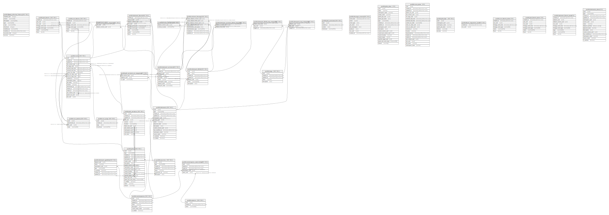

# marquez

## Tables

| Name | Columns | Comment | Type |
| ---- | ------- | ------- | ---- |
| [public.flyway_schema_history](public.flyway_schema_history.md) | 10 |  | BASE TABLE |
| [public.namespaces](public.namespaces.md) | 7 |  | BASE TABLE |
| [public.owners](public.owners.md) | 3 |  | BASE TABLE |
| [public.namespace_ownerships](public.namespace_ownerships.md) | 5 |  | BASE TABLE |
| [public.sources](public.sources.md) | 7 |  | BASE TABLE |
| [public.datasets](public.datasets.md) | 15 |  | BASE TABLE |
| [public.jobs](public.jobs.md) | 18 |  | BASE TABLE |
| [public.job_versions](public.job_versions.md) | 11 |  | BASE TABLE |
| [public.job_versions_io_mapping](public.job_versions_io_mapping.md) | 3 |  | BASE TABLE |
| [public.run_args](public.run_args.md) | 4 |  | BASE TABLE |
| [public.runs](public.runs.md) | 20 |  | BASE TABLE |
| [public.run_states](public.run_states.md) | 4 |  | BASE TABLE |
| [public.dataset_versions](public.dataset_versions.md) | 9 |  | BASE TABLE |
| [public.stream_versions](public.stream_versions.md) | 2 |  | BASE TABLE |
| [public.runs_input_mapping](public.runs_input_mapping.md) | 2 |  | BASE TABLE |
| [public.job_contexts](public.job_contexts.md) | 4 |  | BASE TABLE |
| [public.dataset_fields](public.dataset_fields.md) | 7 |  | BASE TABLE |
| [public.dataset_versions_field_mapping](public.dataset_versions_field_mapping.md) | 2 |  | BASE TABLE |
| [public.tags](public.tags.md) | 5 |  | BASE TABLE |
| [public.datasets_tag_mapping](public.datasets_tag_mapping.md) | 3 |  | BASE TABLE |
| [public.dataset_fields_tag_mapping](public.dataset_fields_tag_mapping.md) | 3 |  | BASE TABLE |
| [public.lineage_events](public.lineage_events.md) | 8 |  | BASE TABLE |
| [public.jobs_view](public.jobs_view.md) | 18 |  | VIEW |
| [public.runs_view](public.runs_view.md) | 20 |  | VIEW |
| [public.jobs_fqn](public.jobs_fqn.md) | 6 |  | BASE TABLE |
| [public.dataset_symlinks](public.dataset_symlinks.md) | 7 |  | BASE TABLE |
| [public.column_lineage](public.column_lineage.md) | 8 |  | BASE TABLE |
| [public.dataset_facets](public.dataset_facets.md) | 9 |  | BASE TABLE |
| [public.job_facets](public.job_facets.md) | 7 |  | BASE TABLE |
| [public.run_facets](public.run_facets.md) | 6 |  | BASE TABLE |
| [public.facet_migration_lock](public.facet_migration_lock.md) | 2 |  | BASE TABLE |
| [public.run_facets_view](public.run_facets_view.md) | 6 |  | VIEW |
| [public.job_facets_view](public.job_facets_view.md) | 7 |  | VIEW |
| [public.dataset_facets_view](public.dataset_facets_view.md) | 9 |  | VIEW |
| [public.datasets_view](public.datasets_view.md) | 15 |  | VIEW |

## Stored procedures and functions

| Name | ReturnType | Arguments | Type |
| ---- | ------- | ------- | ---- |
| public.write_run_job_uuid | trigger |  | FUNCTION |
| public.rewrite_jobs_fqn_table | trigger |  | FUNCTION |

## Relations

---

> Generated by [tbls](https://github.com/k1LoW/tbls)
