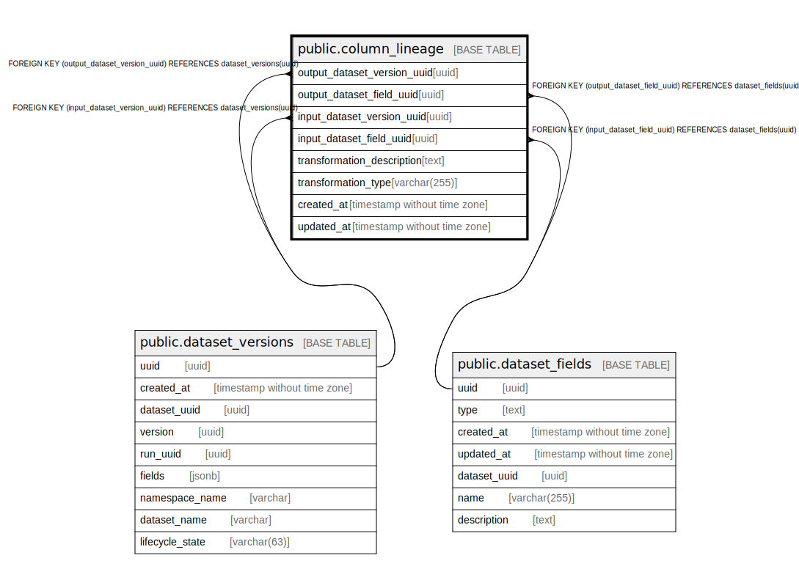

# public.column_lineage

## Description

## Columns

| Name | Type | Default | Nullable | Children | Parents | Comment |
| ---- | ---- | ------- | -------- | -------- | ------- | ------- |
| output_dataset_version_uuid | uuid |  | true |  | [public.dataset_versions](public.dataset_versions.md) |  |
| output_dataset_field_uuid | uuid |  | true |  | [public.dataset_fields](public.dataset_fields.md) |  |
| input_dataset_version_uuid | uuid |  | true |  | [public.dataset_versions](public.dataset_versions.md) |  |
| input_dataset_field_uuid | uuid |  | true |  | [public.dataset_fields](public.dataset_fields.md) |  |
| transformation_description | text |  | true |  |  |  |
| transformation_type | varchar(255) |  | true |  |  |  |
| created_at | timestamp without time zone |  | false |  |  |  |
| updated_at | timestamp without time zone |  | false |  |  |  |

## Constraints

| Name | Type | Definition |
| ---- | ---- | ---------- |
| column_lineage_input_dataset_version_uuid_fkey | FOREIGN KEY | FOREIGN KEY (input_dataset_version_uuid) REFERENCES dataset_versions(uuid) |
| column_lineage_output_dataset_version_uuid_fkey | FOREIGN KEY | FOREIGN KEY (output_dataset_version_uuid) REFERENCES dataset_versions(uuid) |
| column_lineage_input_dataset_field_uuid_fkey | FOREIGN KEY | FOREIGN KEY (input_dataset_field_uuid) REFERENCES dataset_fields(uuid) |
| column_lineage_output_dataset_field_uuid_fkey | FOREIGN KEY | FOREIGN KEY (output_dataset_field_uuid) REFERENCES dataset_fields(uuid) |
| column_lineage_output_dataset_version_uuid_output_dataset_f_key | UNIQUE | UNIQUE (output_dataset_version_uuid, output_dataset_field_uuid, input_dataset_version_uuid, input_dataset_field_uuid) |

## Indexes

| Name | Definition |
| ---- | ---------- |
| column_lineage_output_dataset_version_uuid_output_dataset_f_key | CREATE UNIQUE INDEX column_lineage_output_dataset_version_uuid_output_dataset_f_key ON public.column_lineage USING btree (output_dataset_version_uuid, output_dataset_field_uuid, input_dataset_version_uuid, input_dataset_field_uuid) |
| column_lineage_output_dataset_version_uuid_index | CREATE INDEX column_lineage_output_dataset_version_uuid_index ON public.column_lineage USING btree (output_dataset_version_uuid) |
| column_lineage_output_dataset_field_uuid_index | CREATE INDEX column_lineage_output_dataset_field_uuid_index ON public.column_lineage USING btree (output_dataset_field_uuid) |
| column_lineage_input_dataset_version_uuid_index | CREATE INDEX column_lineage_input_dataset_version_uuid_index ON public.column_lineage USING btree (input_dataset_version_uuid) |
| column_lineage_input_dataset_field_uuid_index | CREATE INDEX column_lineage_input_dataset_field_uuid_index ON public.column_lineage USING btree (input_dataset_field_uuid) |

## Relations

---

> Generated by [tbls](https://github.com/k1LoW/tbls)
