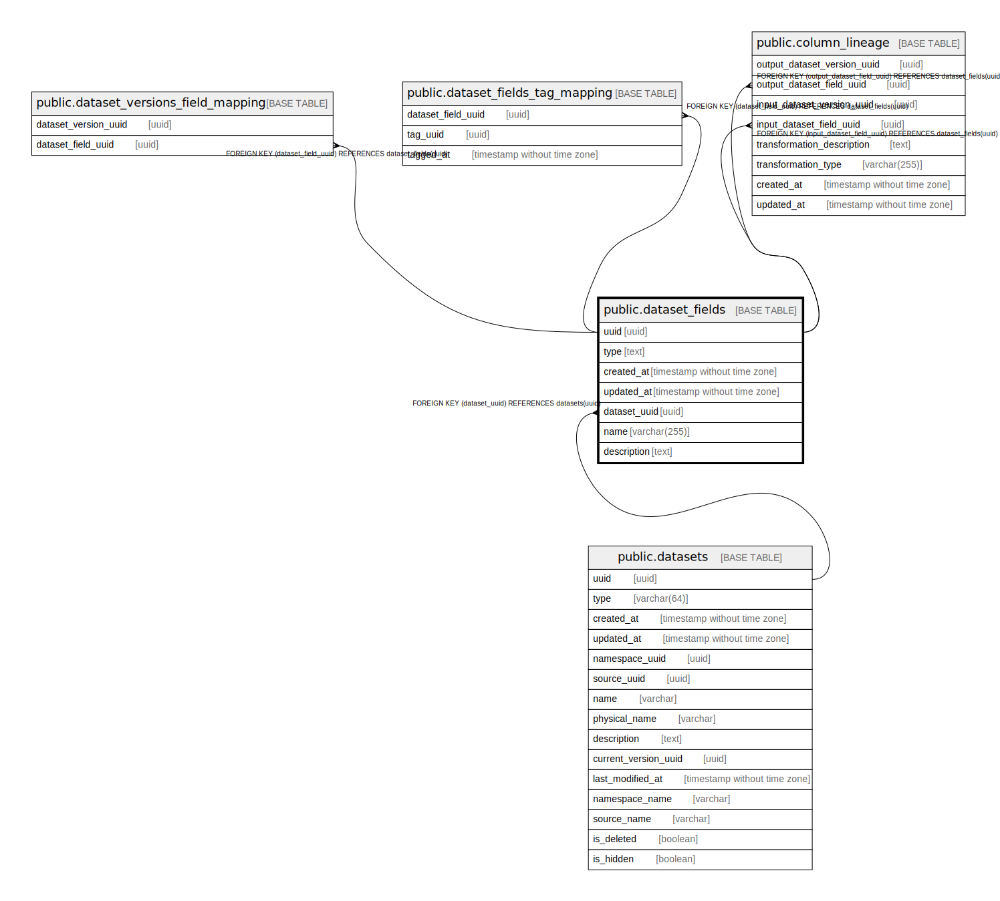

# public.dataset_fields

## Description

## Columns

| Name | Type | Default | Nullable | Children | Parents | Comment |
| ---- | ---- | ------- | -------- | -------- | ------- | ------- |
| uuid | uuid |  | false | [public.dataset_versions_field_mapping](public.dataset_versions_field_mapping.md) [public.dataset_fields_tag_mapping](public.dataset_fields_tag_mapping.md) [public.column_lineage](public.column_lineage.md) |  |  |
| type | text |  | true |  |  |  |
| created_at | timestamp without time zone |  | false |  |  |  |
| updated_at | timestamp without time zone |  | false |  |  |  |
| dataset_uuid | uuid |  | true |  | [public.datasets](public.datasets.md) |  |
| name | varchar(255) |  | false |  |  |  |
| description | text |  | true |  |  |  |

## Constraints

| Name | Type | Definition |
| ---- | ---- | ---------- |
| dataset_fields_dataset_uuid_fkey | FOREIGN KEY | FOREIGN KEY (dataset_uuid) REFERENCES datasets(uuid) |
| dataset_fields_pkey | PRIMARY KEY | PRIMARY KEY (uuid) |
| dataset_fields_dataset_uuid_name_type_key | UNIQUE | UNIQUE (dataset_uuid, name, type) |

## Indexes

| Name | Definition |
| ---- | ---------- |
| dataset_fields_pkey | CREATE UNIQUE INDEX dataset_fields_pkey ON public.dataset_fields USING btree (uuid) |
| dataset_fields_name_index | CREATE INDEX dataset_fields_name_index ON public.dataset_fields USING btree (name, dataset_uuid) |
| dataset_fields_dataset_uuid_name_type_key | CREATE UNIQUE INDEX dataset_fields_dataset_uuid_name_type_key ON public.dataset_fields USING btree (dataset_uuid, name, type) |
| dataset_fields_dataset_uuid | CREATE INDEX dataset_fields_dataset_uuid ON public.dataset_fields USING btree (dataset_uuid) |

## Relations

---

> Generated by [tbls](https://github.com/k1LoW/tbls)
