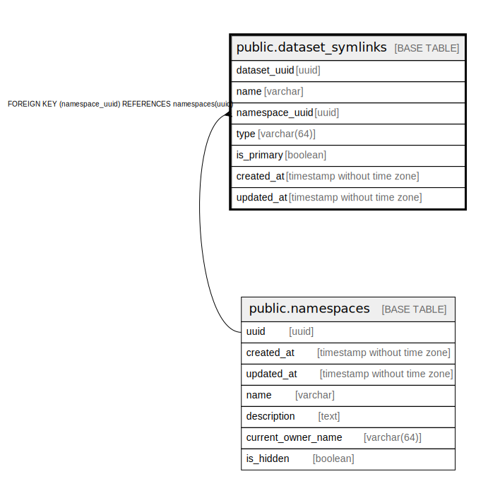

# public.dataset_symlinks

## Description

## Columns

| Name | Type | Default | Nullable | Children | Parents | Comment |
| ---- | ---- | ------- | -------- | -------- | ------- | ------- |
| dataset_uuid | uuid |  | true |  |  |  |
| name | varchar |  | false |  |  |  |
| namespace_uuid | uuid |  | true |  | [public.namespaces](public.namespaces.md) |  |
| type | varchar(64) |  | true |  |  |  |
| is_primary | boolean | false | true |  |  |  |
| created_at | timestamp without time zone |  | false |  |  |  |
| updated_at | timestamp without time zone |  | false |  |  |  |

## Constraints

| Name | Type | Definition |
| ---- | ---- | ---------- |
| dataset_symlinks_namespace_uuid_fkey | FOREIGN KEY | FOREIGN KEY (namespace_uuid) REFERENCES namespaces(uuid) |
| dataset_symlinks_namespace_uuid_name_key | UNIQUE | UNIQUE (namespace_uuid, name) |

## Indexes

| Name | Definition |
| ---- | ---------- |
| dataset_symlinks_dataset_uuid | CREATE INDEX dataset_symlinks_dataset_uuid ON public.dataset_symlinks USING btree (dataset_uuid) |
| dataset_symlinks_namespace_uuid_name_key | CREATE UNIQUE INDEX dataset_symlinks_namespace_uuid_name_key ON public.dataset_symlinks USING btree (namespace_uuid, name) |

## Relations

---

> Generated by [tbls](https://github.com/k1LoW/tbls)
