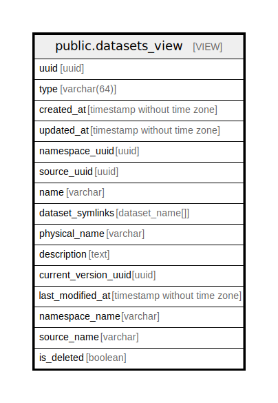

# public.datasets_view

## Description

<details>
<summary><strong>Table Definition</strong></summary>

```sql
CREATE VIEW datasets_view AS (
 SELECT d.uuid,
    d.type,
    d.created_at,
    d.updated_at,
    d.namespace_uuid,
    d.source_uuid,
    d.name,
    array_agg(ROW((namespaces.name)::character varying(255), (symlinks.name)::character varying(255))::dataset_name) AS dataset_symlinks,
    d.physical_name,
    d.description,
    d.current_version_uuid,
    d.last_modified_at,
    d.namespace_name,
    d.source_name,
    d.is_deleted
   FROM ((datasets d
     JOIN dataset_symlinks symlinks ON ((d.uuid = symlinks.dataset_uuid)))
     JOIN namespaces ON ((symlinks.namespace_uuid = namespaces.uuid)))
  WHERE (d.is_hidden IS FALSE)
  GROUP BY d.uuid
)
```

</details>

## Referenced Tables

- [public.datasets](public.datasets.md)
- [public.dataset_symlinks](public.dataset_symlinks.md)
- [public.namespaces](public.namespaces.md)

## Columns

| Name | Type | Default | Nullable | Children | Parents | Comment |
| ---- | ---- | ------- | -------- | -------- | ------- | ------- |
| uuid | uuid |  | true |  |  |  |
| type | varchar(64) |  | true |  |  |  |
| created_at | timestamp without time zone |  | true |  |  |  |
| updated_at | timestamp without time zone |  | true |  |  |  |
| namespace_uuid | uuid |  | true |  |  |  |
| source_uuid | uuid |  | true |  |  |  |
| name | varchar |  | true |  |  |  |
| dataset_symlinks | dataset_name[] |  | true |  |  |  |
| physical_name | varchar |  | true |  |  |  |
| description | text |  | true |  |  |  |
| current_version_uuid | uuid |  | true |  |  |  |
| last_modified_at | timestamp without time zone |  | true |  |  |  |
| namespace_name | varchar |  | true |  |  |  |
| source_name | varchar |  | true |  |  |  |
| is_deleted | boolean |  | true |  |  |  |

## Relations



---

> Generated by [tbls](https://github.com/k1LoW/tbls)
