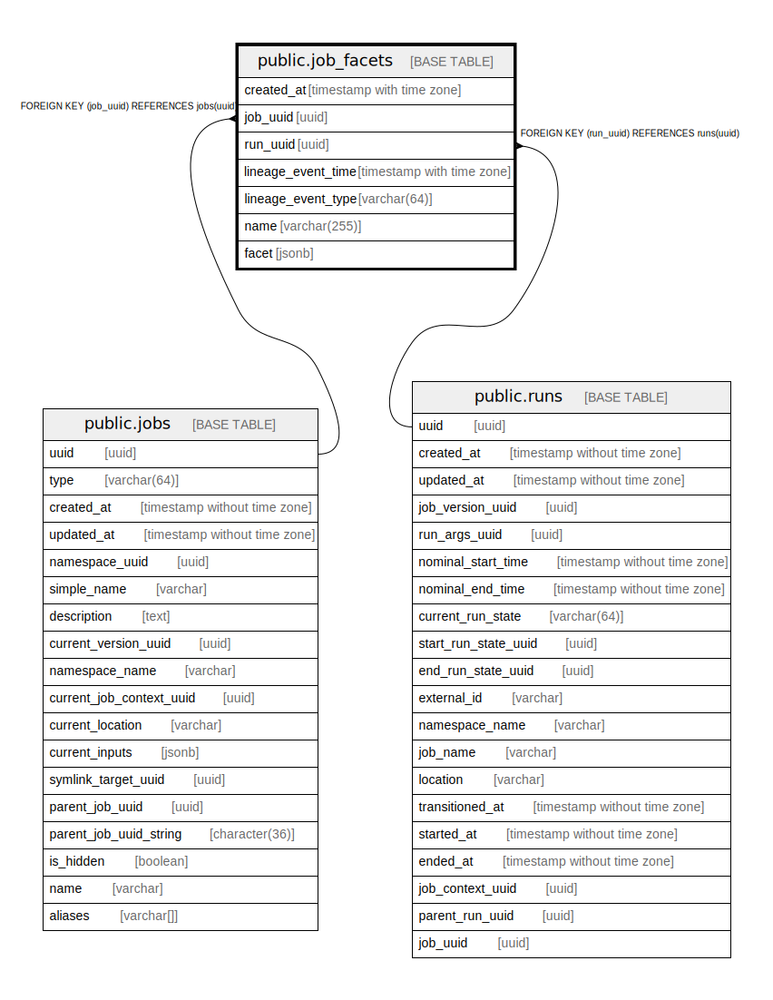

# public.job_facets

## Description

## Columns

| Name | Type | Default | Nullable | Children | Parents | Comment |
| ---- | ---- | ------- | -------- | -------- | ------- | ------- |
| created_at | timestamp with time zone |  | false |  |  |  |
| job_uuid | uuid |  | true |  | [public.jobs](public.jobs.md) |  |
| run_uuid | uuid |  | true |  | [public.runs](public.runs.md) |  |
| lineage_event_time | timestamp with time zone |  | false |  |  |  |
| lineage_event_type | varchar(64) |  | false |  |  |  |
| name | varchar(255) |  | false |  |  |  |
| facet | jsonb |  | false |  |  |  |

## Constraints

| Name | Type | Definition |
| ---- | ---- | ---------- |
| job_facets_job_uuid_fkey | FOREIGN KEY | FOREIGN KEY (job_uuid) REFERENCES jobs(uuid) |
| job_facets_run_uuid_fkey | FOREIGN KEY | FOREIGN KEY (run_uuid) REFERENCES runs(uuid) |

## Indexes

| Name | Definition |
| ---- | ---------- |
| job_facets_job_uuid_run_uuid_idx | CREATE INDEX job_facets_job_uuid_run_uuid_idx ON public.job_facets USING btree (job_uuid, run_uuid) |
| job_facets_job_uuid_index | CREATE INDEX job_facets_job_uuid_index ON public.job_facets USING btree (job_uuid) |
| job_facets_run_uuid_index | CREATE INDEX job_facets_run_uuid_index ON public.job_facets USING btree (run_uuid) |

## Relations

---

> Generated by [tbls](https://github.com/k1LoW/tbls)
