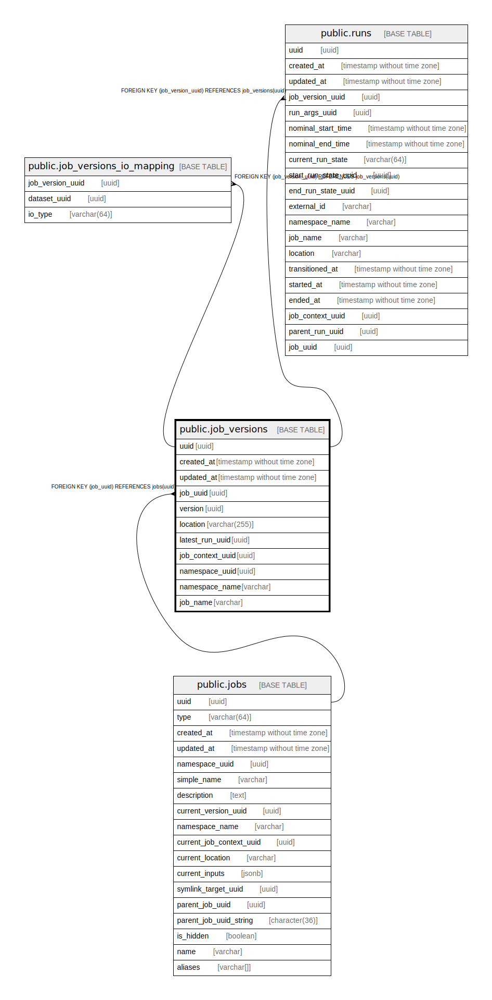

# public.job_versions

## Description

## Columns

| Name | Type | Default | Nullable | Children | Parents | Comment |
| ---- | ---- | ------- | -------- | -------- | ------- | ------- |
| uuid | uuid |  | false | [public.job_versions_io_mapping](public.job_versions_io_mapping.md) [public.runs](public.runs.md) |  |  |
| created_at | timestamp without time zone |  | false |  |  |  |
| updated_at | timestamp without time zone |  | false |  |  |  |
| job_uuid | uuid |  | true |  | [public.jobs](public.jobs.md) |  |
| version | uuid |  | false |  |  |  |
| location | varchar(255) |  | true |  |  |  |
| latest_run_uuid | uuid |  | true |  |  |  |
| job_context_uuid | uuid |  | true |  |  |  |
| namespace_uuid | uuid |  | true |  |  |  |
| namespace_name | varchar |  | true |  |  |  |
| job_name | varchar |  | true |  |  |  |

## Constraints

| Name | Type | Definition |
| ---- | ---- | ---------- |
| job_versions_job_uuid_fkey | FOREIGN KEY | FOREIGN KEY (job_uuid) REFERENCES jobs(uuid) |
| job_versions_pkey | PRIMARY KEY | PRIMARY KEY (uuid) |
| job_versions_job_uuid_version_key | UNIQUE | UNIQUE (job_uuid, version) |
| job_versions_version | UNIQUE | UNIQUE (version) |

## Indexes

| Name | Definition |
| ---- | ---------- |
| job_versions_pkey | CREATE UNIQUE INDEX job_versions_pkey ON public.job_versions USING btree (uuid) |
| job_versions_job_uuid_version_key | CREATE UNIQUE INDEX job_versions_job_uuid_version_key ON public.job_versions USING btree (job_uuid, version) |
| job_versions_version | CREATE UNIQUE INDEX job_versions_version ON public.job_versions USING btree (version) |
| job_versions_selector | CREATE INDEX job_versions_selector ON public.job_versions USING btree (job_name, namespace_name) |

## Relations

---

> Generated by [tbls](https://github.com/k1LoW/tbls)
