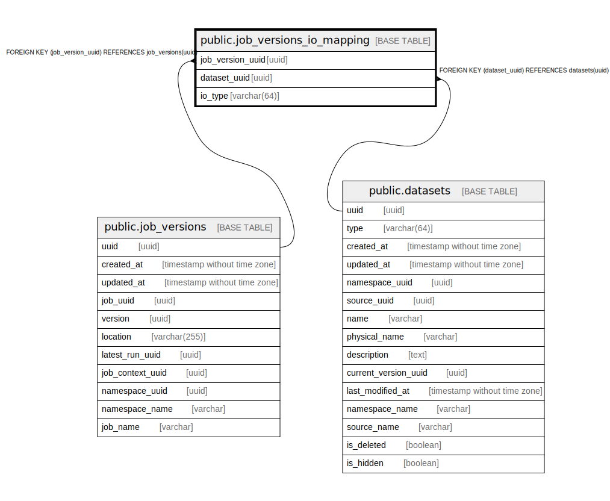

# public.job_versions_io_mapping

## Description

## Columns

| Name | Type | Default | Nullable | Children | Parents | Comment |
| ---- | ---- | ------- | -------- | -------- | ------- | ------- |
| job_version_uuid | uuid |  | false |  | [public.job_versions](public.job_versions.md) |  |
| dataset_uuid | uuid |  | false |  | [public.datasets](public.datasets.md) |  |
| io_type | varchar(64) |  | false |  |  |  |

## Constraints

| Name | Type | Definition |
| ---- | ---- | ---------- |
| job_versions_io_mapping_dataset_uuid_fkey | FOREIGN KEY | FOREIGN KEY (dataset_uuid) REFERENCES datasets(uuid) |
| job_versions_io_mapping_job_version_uuid_fkey | FOREIGN KEY | FOREIGN KEY (job_version_uuid) REFERENCES job_versions(uuid) |
| job_versions_io_mapping_pkey | PRIMARY KEY | PRIMARY KEY (job_version_uuid, dataset_uuid, io_type) |

## Indexes

| Name | Definition |
| ---- | ---------- |
| job_versions_io_mapping_pkey | CREATE UNIQUE INDEX job_versions_io_mapping_pkey ON public.job_versions_io_mapping USING btree (job_version_uuid, dataset_uuid, io_type) |

## Relations

---

> Generated by [tbls](https://github.com/k1LoW/tbls)
