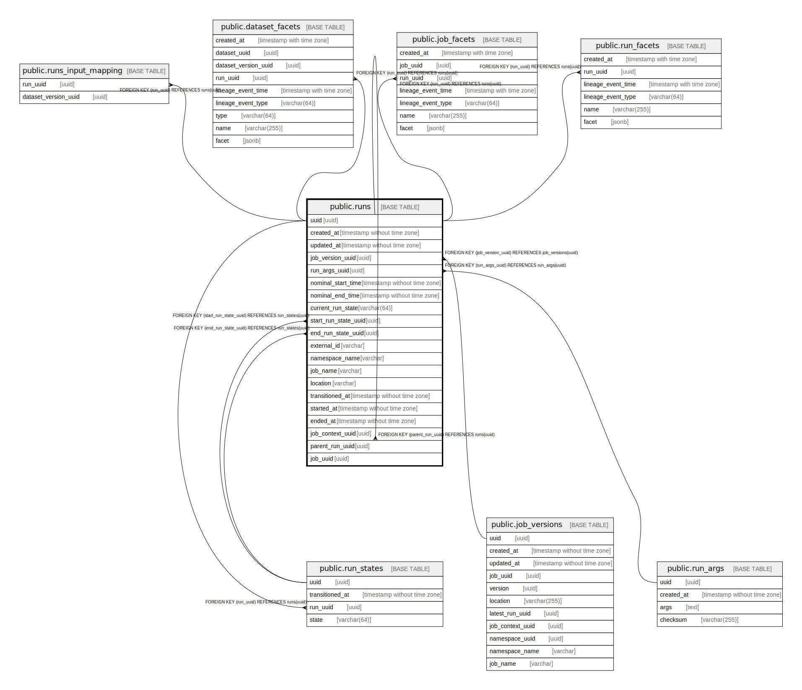

# public.runs

## Description

## Columns

| Name | Type | Default | Nullable | Children | Parents | Comment |
| ---- | ---- | ------- | -------- | -------- | ------- | ------- |
| uuid | uuid |  | false | [public.runs](public.runs.md) [public.run_states](public.run_states.md) [public.runs_input_mapping](public.runs_input_mapping.md) [public.dataset_facets](public.dataset_facets.md) [public.job_facets](public.job_facets.md) [public.run_facets](public.run_facets.md) |  |  |
| created_at | timestamp without time zone |  | false |  |  |  |
| updated_at | timestamp without time zone |  | false |  |  |  |
| job_version_uuid | uuid |  | true |  | [public.job_versions](public.job_versions.md) |  |
| run_args_uuid | uuid |  | true |  | [public.run_args](public.run_args.md) |  |
| nominal_start_time | timestamp without time zone |  | true |  |  |  |
| nominal_end_time | timestamp without time zone |  | true |  |  |  |
| current_run_state | varchar(64) |  | true |  |  |  |
| start_run_state_uuid | uuid |  | true |  | [public.run_states](public.run_states.md) |  |
| end_run_state_uuid | uuid |  | true |  | [public.run_states](public.run_states.md) |  |
| external_id | varchar |  | true |  |  |  |
| namespace_name | varchar |  | true |  |  |  |
| job_name | varchar |  | true |  |  |  |
| location | varchar |  | true |  |  |  |
| transitioned_at | timestamp without time zone |  | true |  |  |  |
| started_at | timestamp without time zone |  | true |  |  |  |
| ended_at | timestamp without time zone |  | true |  |  |  |
| job_context_uuid | uuid |  | true |  |  |  |
| parent_run_uuid | uuid |  | true |  | [public.runs](public.runs.md) |  |
| job_uuid | uuid |  | true |  |  |  |

## Constraints

| Name | Type | Definition |
| ---- | ---- | ---------- |
| runs_job_version_uuid_fkey | FOREIGN KEY | FOREIGN KEY (job_version_uuid) REFERENCES job_versions(uuid) |
| runs_run_args_uuid_fkey | FOREIGN KEY | FOREIGN KEY (run_args_uuid) REFERENCES run_args(uuid) |
| runs_parent_fk_runs | FOREIGN KEY | FOREIGN KEY (parent_run_uuid) REFERENCES runs(uuid) |
| runs_pkey | PRIMARY KEY | PRIMARY KEY (uuid) |
| runs_end_run_state_uuid_fkey | FOREIGN KEY | FOREIGN KEY (end_run_state_uuid) REFERENCES run_states(uuid) |
| runs_start_run_state_uuid_fkey | FOREIGN KEY | FOREIGN KEY (start_run_state_uuid) REFERENCES run_states(uuid) |

## Indexes

| Name | Definition |
| ---- | ---------- |
| runs_pkey | CREATE UNIQUE INDEX runs_pkey ON public.runs USING btree (uuid) |
| runs_created_at_current_run_state_index | CREATE INDEX runs_created_at_current_run_state_index ON public.runs USING btree (created_at DESC, current_run_state) |
| runs_created_at_index | CREATE INDEX runs_created_at_index ON public.runs USING btree (created_at DESC) |
| runs_created_at_completed_index | CREATE INDEX runs_created_at_completed_index ON public.runs USING btree (created_at DESC) INCLUDE (job_name, namespace_name, started_at, ended_at) WHERE ((current_run_state)::text = 'COMPLETED'::text) |
| runs_created_at_completed_by_name_index | CREATE INDEX runs_created_at_completed_by_name_index ON public.runs USING btree (job_name, namespace_name, created_at DESC) INCLUDE (started_at, ended_at) WHERE ((current_run_state)::text = 'COMPLETED'::text) |
| runs_created_at_by_name_index | CREATE INDEX runs_created_at_by_name_index ON public.runs USING btree (job_name, namespace_name, created_at DESC) INCLUDE (uuid, created_at, updated_at, nominal_start_time, nominal_end_time, current_run_state, started_at, ended_at, namespace_name, job_name, location) |
| runs_job_uuid | CREATE INDEX runs_job_uuid ON public.runs USING btree (job_uuid, transitioned_at DESC) |

## Triggers

| Name | Definition |
| ---- | ---------- |
| runs_insert_job_uuid | CREATE TRIGGER runs_insert_job_uuid BEFORE INSERT ON public.runs FOR EACH ROW WHEN (((new.job_uuid IS NULL) AND (new.job_name IS NOT NULL) AND (new.namespace_name IS NOT NULL))) EXECUTE FUNCTION write_run_job_uuid() |

## Relations

---

> Generated by [tbls](https://github.com/k1LoW/tbls)
