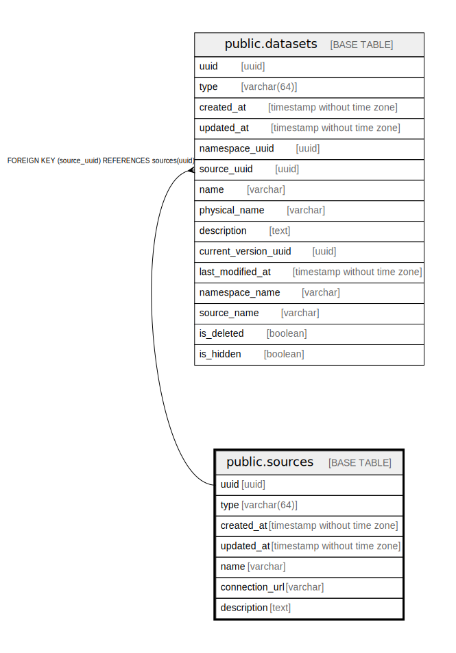

# public.sources

## Description

## Columns

| Name | Type | Default | Nullable | Children | Parents | Comment |
| ---- | ---- | ------- | -------- | -------- | ------- | ------- |
| uuid | uuid |  | false | [public.datasets](public.datasets.md) |  |  |
| type | varchar(64) |  | false |  |  |  |
| created_at | timestamp without time zone |  | false |  |  |  |
| updated_at | timestamp without time zone |  | false |  |  |  |
| name | varchar |  | false |  |  |  |
| connection_url | varchar |  | false |  |  |  |
| description | text |  | true |  |  |  |

## Constraints

| Name | Type | Definition |
| ---- | ---- | ---------- |
| sources_pkey | PRIMARY KEY | PRIMARY KEY (uuid) |
| sources_name_key | UNIQUE | UNIQUE (name) |

## Indexes

| Name | Definition |
| ---- | ---------- |
| sources_pkey | CREATE UNIQUE INDEX sources_pkey ON public.sources USING btree (uuid) |
| sources_name_key | CREATE UNIQUE INDEX sources_name_key ON public.sources USING btree (name) |

## Relations

---

> Generated by [tbls](https://github.com/k1LoW/tbls)
