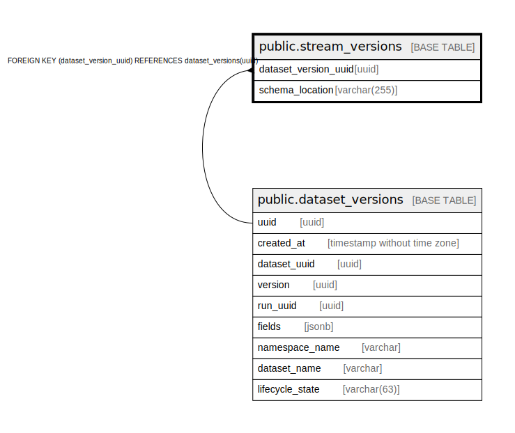

# public.stream_versions

## Description

## Columns

| Name | Type | Default | Nullable | Children | Parents | Comment |
| ---- | ---- | ------- | -------- | -------- | ------- | ------- |
| dataset_version_uuid | uuid |  | true |  | [public.dataset_versions](public.dataset_versions.md) |  |
| schema_location | varchar(255) |  | false |  |  |  |

## Constraints

| Name | Type | Definition |
| ---- | ---- | ---------- |
| stream_versions_dataset_version_uuid_fkey | FOREIGN KEY | FOREIGN KEY (dataset_version_uuid) REFERENCES dataset_versions(uuid) |
| stream_versions_schema_location_key | UNIQUE | UNIQUE (schema_location) |

## Indexes

| Name | Definition |
| ---- | ---------- |
| stream_versions_schema_location_key | CREATE UNIQUE INDEX stream_versions_schema_location_key ON public.stream_versions USING btree (schema_location) |
| stream_versions_dataset_version_index | CREATE UNIQUE INDEX stream_versions_dataset_version_index ON public.stream_versions USING btree (dataset_version_uuid) |

## Relations

---

> Generated by [tbls](https://github.com/k1LoW/tbls)
